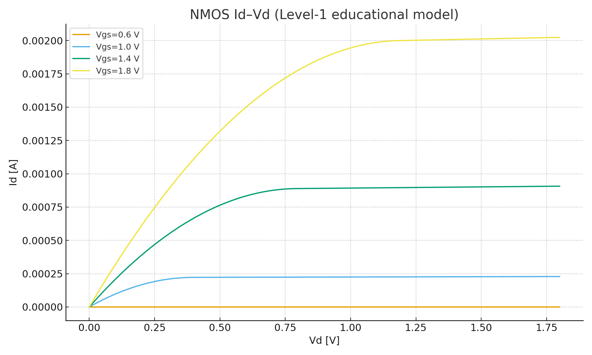

# 🔬 DeviceTemplates

NMOS/PMOS の基本特性を観察するための **最小 SPICE テンプレート集**  
*Minimal SPICE template collection to observe basic NMOS/PMOS characteristics.*

---

## 🎯 目的 | Purpose
- 半導体デバイスの **Id–Vd, Id–Vg** 特性を理解する  
  *Understand transistor Id–Vd and Id–Vg characteristics*  
- W/L や電源電圧の違いによるデバイス挙動を比較する  
  *Compare device behaviors under different W/L ratios and supply voltages*  
- SPICE シミュレーションから CSV 出力 → 可視化（Excel/Python）  
  *Export CSV from SPICE simulation and visualize with Excel/Python*  

---

## 📂 含まれるファイル | Contents

| ファイル名 | 説明 |
|------------|------|
| `NMOS_IdVd_018um_1v8.sp` | **NMOS Id–Vd テンプレート**（W=10µm / L=0.18µm, VDD=1.8V）<br>*NMOS Id–Vd template (W=10µm / L=0.18µm, VDD=1.8V)* |
| `README.md` | **本ファイル**（使い方と概要）<br>*This file (overview and usage)* |

---

## ⚙️ 使い方 | Usage

1. `.include` を自分の PDK モデルファイルに差し替え  
   *Replace `.include` with your PDK model file*  
2. 実行:  
   ```bash
   ngspice NMOS_IdVd_018um_1v8.sp
   ```  
   *Run the SPICE simulation*  
3. 出力: `IdVd_Vgs*.csv` を可視化（Excel や Python）  
   *Visualize the output `IdVd_Vgs*.csv` using Excel or Python*  

---

## 📊 出力例 | Example Result

  

例: Id–Vd 曲線、各 Vgs に対するドレイン電流特性  
*Example: Id–Vd curves showing drain current for different Vgs values*  

---

## 🚀 今後の拡張 | Future Extensions
- PMOS テンプレートの追加  
  *Add PMOS templates*  
- W/L バリエーション（短チャネル効果などの確認）  
  *W/L variations (observe short-channel effects)*  
- 高電圧プロセス対応の Id–Vd 特性  
  *Id–Vd characteristics for high-voltage processes*  
