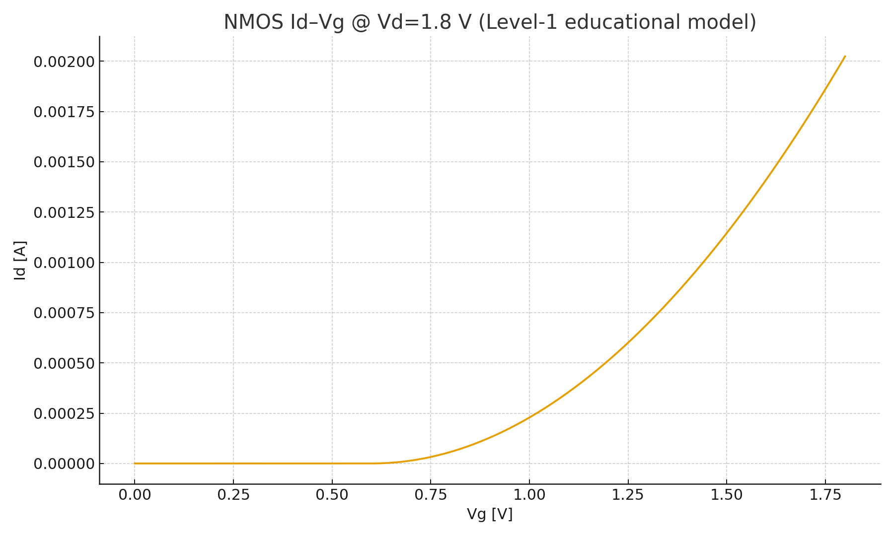

---

# 🔬 DeviceTemplates

NMOS/PMOS の基本特性を観察するための **最小 SPICE テンプレート集**  
*Minimal SPICE template collection to observe basic NMOS/PMOS characteristics.*

---

## 🎯 目的 | Purpose
- 半導体デバイスの **Id–Vd, Id–Vg** 特性を理解する  
  *Understand transistor Id–Vd and Id–Vg characteristics*  
- W/L や電源電圧の違いによるデバイス挙動を比較する  
  *Compare device behaviors under different W/L ratios and supply voltages*  
- SPICE シミュレーションから CSV 出力 → 可視化（Excel/Python）  
  *Export CSV from SPICE simulation and visualize with Excel/Python*  

---

## 📂 含まれるファイル | Contents

| ファイル名 | 説明 |
|------------|------|
| `NMOS_IdVd_018um_1v8.sp` | **NMOS Id–Vd テンプレート**（W=10µm / L=0.18µm, VDD=1.8V）<br>*NMOS Id–Vd template (W=10µm / L=0.18µm, VDD=1.8V)* |
| `README.md` | **本ファイル**（使い方と概要）<br>*This file (overview and usage)* |

---

## ⚙️ 使い方 | Usage

### 1. 教育用（PDK不要） | For Education (No PDK required)
本テンプレートは `.model` を使っており、PDK を持っていなくても動かせます。  
*This template uses `.model`, so it runs without a PDK.*  

例:  
```spice
.model NMOS NMOS (LEVEL=1 VTO=0.7 KP=50u LAMBDA=0.02)
```

### 2. 実プロセス利用（PDKあり） | For Real Process (With PDK)
実際のプロセスを使う場合は `.include` を使い、PDK のモデルファイルを読み込みます。  
*For real process models, replace with `.include` to load your PDK model file.*  

例:  
```spice
.include sky130_fd_pr__nfet_01v8.model
```

### 3. 実行方法 | How to Run
```bash
ngspice NMOS_IdVd_018um_1v8.sp
```
*Run the SPICE simulation.*  

### 4. 出力結果 | Output
生成された `IdVd_Vgs*.csv` を Excel や Python で可視化します。  
*Visualize the generated `IdVd_Vgs*.csv` using Excel or Python.*  

---

## 📊 出力例 | Example Result

### Id–Vd 特性 | Id–Vd Characteristics
Vgs をパラメータとしたドレイン電流–電圧特性  
*Drain current–voltage characteristics with Vgs as a parameter*  

<p align="center">
  
</p>

---

### Id–Vg 特性 | Id–Vg Characteristics
Vd を一定に固定したときのゲート電圧–ドレイン電流特性  
*Gate voltage–drain current characteristics at constant Vd*  

<p align="center">
  
</p>

---

## 🚀 今後の拡張 | Future Extensions
- PMOS テンプレートの追加  
  *Add PMOS templates*  
- W/L バリエーション（短チャネル効果などの確認）  
  *W/L variations (observe short-channel effects)*  
- 高電圧プロセス対応の Id–Vd 特性  
  *Id–Vd characteristics for high-voltage processes* 
