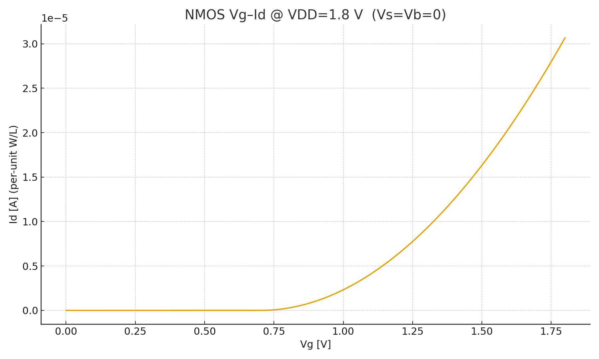
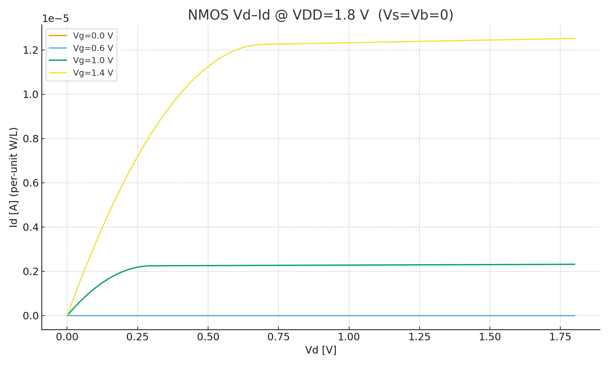
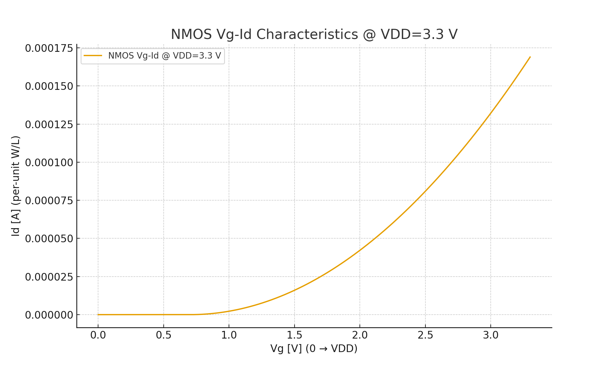
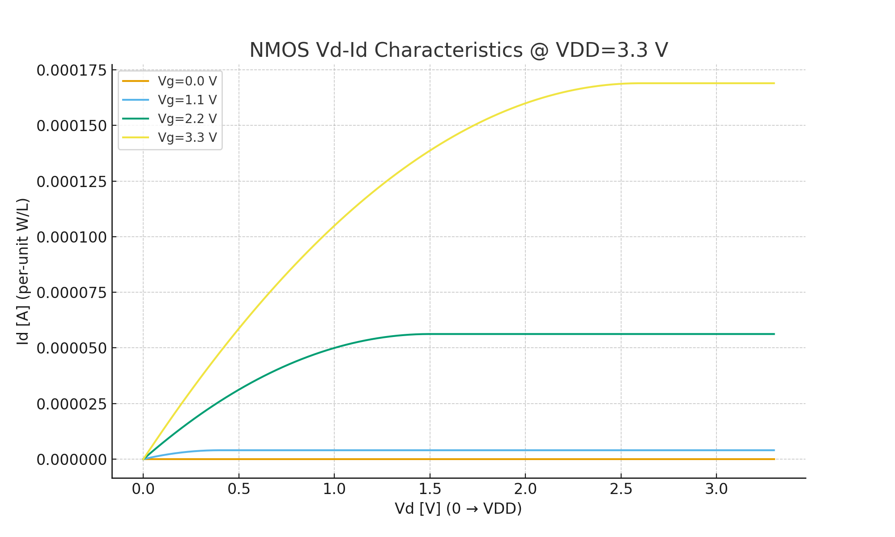
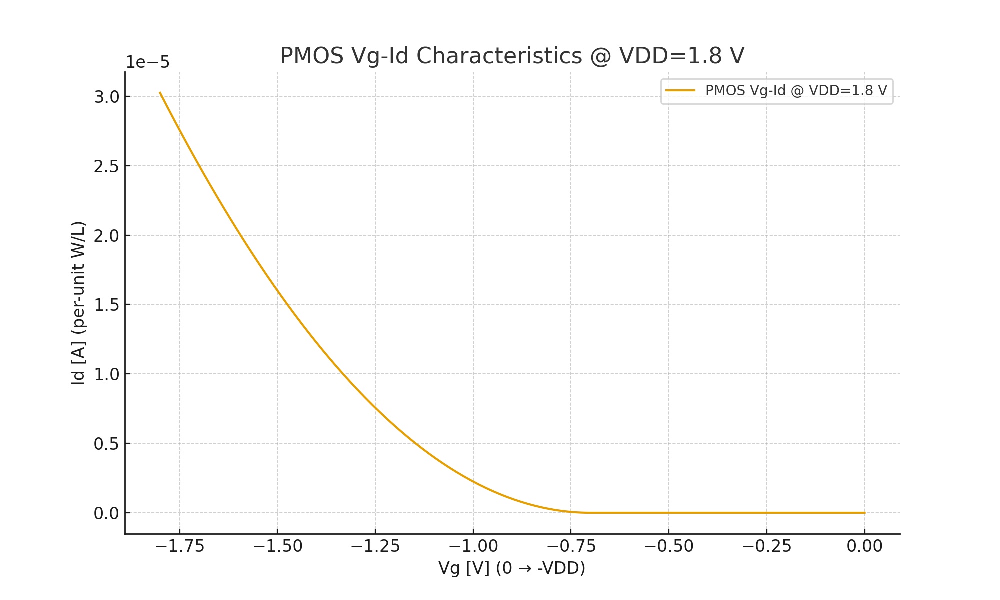
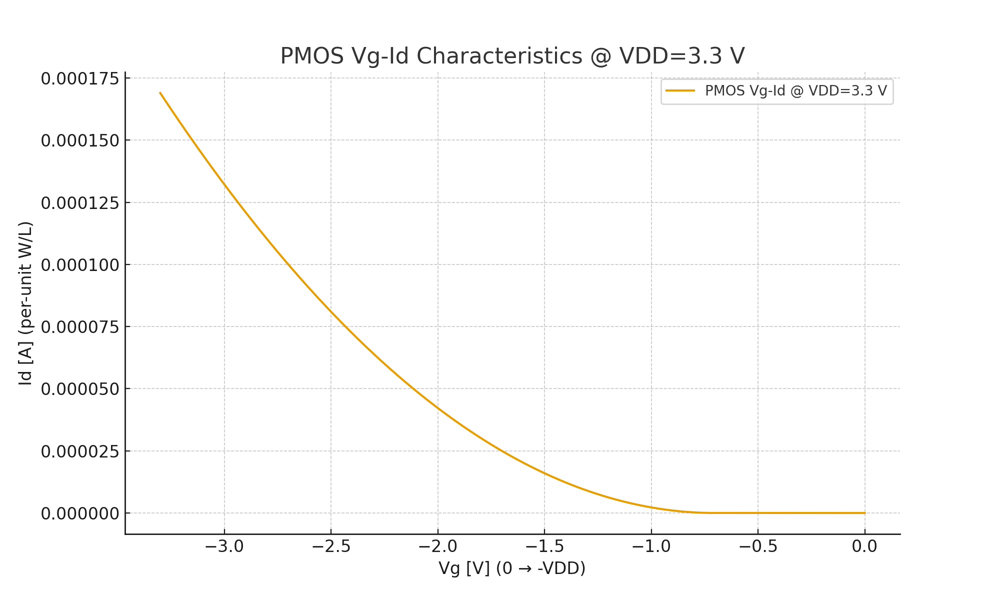
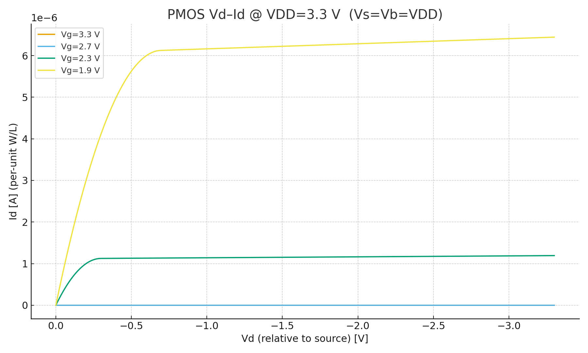

---

# 🔬 DeviceTemplates

NMOS/PMOS の基本特性を観察するための **最小 SPICE テンプレート集**  
*Minimal SPICE template collection to observe basic NMOS/PMOS characteristics.*

---

## 🎯 目的 | Purpose
- 半導体デバイスの **Vd–Id, Vg–Id** 特性を理解する  
  *Understand transistor Vd–Id and Vg–Id characteristics*  
- W/L や電源電圧の違いによるデバイス挙動を比較する  
  *Compare device behaviors under different W/L ratios and supply voltages*  
- SPICE シミュレーションから CSV 出力 → 可視化（Excel/Python）  
  *Export CSV from SPICE simulation and visualize with Excel/Python*  

---

## 📂 含まれるファイル | Contents

| ファイル名 | 説明 |
|------------|------|
| [`NMOS_VgId_1v8.sp`](./NMOS_VgId_1v8.sp) | **NMOS Vg–Id テンプレート**（W=10 µm / L=0.18 µm, VDD=1.8 V）<br>*NMOS Vg–Id template (W=10 µm / L=0.18 µm, VDD=1.8 V)* |
| [`NMOS_VdId_1v8.sp`](./NMOS_VdId_1v8.sp) | **NMOS Vd–Id テンプレート**（W=10 µm / L=0.18 µm, VDD=1.8 V）<br>*NMOS Vd–Id template (W=10 µm / L=0.18 µm, VDD=1.8 V)* |
| [`PMOS_VgId_1v8.sp`](./PMOS_VgId_1v8.sp) | **PMOS Vg–Id テンプレート**（W=10 µm / L=0.18 µm, VDD=1.8 V）<br>*PMOS Vg–Id template (W=10 µm / L=0.18 µm, VDD=1.8 V)* |
| [`PMOS_VdId_1v8.sp`](./PMOS_VdId_1v8.sp) | **PMOS Vd–Id テンプレート**（W=10 µm / L=0.18 µm, VDD=1.8 V）<br>*PMOS Vd–Id template (W=10 µm / L=0.18 µm, VDD=1.8 V)* |
| [`NMOS_VgId_3v3.sp`](./NMOS_VgId_3v3.sp) | **NMOS Vg–Id テンプレート**（W=10 µm / L=0.18 µm, VDD=3.3 V）<br>*NMOS Vg–Id template (W=10 µm / L=0.18 µm, VDD=3.3 V)* |
| [`NMOS_VdId_3v3.sp`](./NMOS_VdId_3v3.sp) | **NMOS Vd–Id テンプレート**（W=10 µm / L=0.18 µm, VDD=3.3 V）<br>*NMOS Vd–Id template (W=10 µm / L=0.18 µm, VDD=3.3 V)* |
| [`PMOS_VgId_3v3.sp`](./PMOS_VgId_3v3.sp) | **PMOS Vg–Id テンプレート**（W=10 µm / L=0.18 µm, VDD=3.3 V）<br>*PMOS Vg–Id template (W=10 µm / L=0.18 µm, VDD=3.3 V)* |
| [`PMOS_VdId_3v3.sp`](./PMOS_VdId_3v3.sp) | **PMOS Vd–Id テンプレート**（W=10 µm / L=0.18 µm, VDD=3.3 V）<br>*PMOS Vd–Id template (W=10 µm / L=0.18 µm, VDD=3.3 V)* |
| [`README.md`](./README.md) | **本ファイル**（使い方と概要）<br>*This file (overview and usage)* |

---

## ⚙️ 使い方 | Usage

1. **教育用の利用**（PDK不要）  
   `.model` を使ったシンプルなデバイスモデルを定義しているため、PDK を持っていなくても動作します。  
   *Educational use with `.model`, no PDK required.*

2. **実プロセスでの利用**  
   実際のプロセスを使う場合は `.include` を使って PDK モデルを読み込みます。  
   *For real processes, replace `.model` with `.include` to load your PDK models.*  

   ```spice
   .include sky130_fd_pr__nfet_01v8.model
   ```

3. **実行例**  
   ngspice でシミュレーションを実行できます。  
   *Run the simulation with ngspice:*  
   ```bash
   ngspice NMOS_VgId_1v8.sp
   ```

4. **出力の可視化**  
   CSV ファイルが生成されるので、Excel や Python で簡単にグラフ化できます。  
   *Generated CSV can be visualized with Excel or Python.*

---

## 📝 ChatGPTとの併用 | With ChatGPT

`.sp` ファイルを ChatGPT に貼り付けると、以下のことが可能です:  
*If you paste the `.sp` file into ChatGPT, you can:*

- **行ごとの意味を解説**  
  *Get explanations line by line (e.g., what `.model` or `.control` means).*  
- **カスタマイズ提案**  
  *Ask how to modify parameters such as W/L, VDD, or sweep steps.*  
- **追加実験例を生成**  
  *Generate variants (e.g., other voltages, multi-finger devices, PMOS versions).*  

---

## 🔧 カスタマイズ例 | Customization Examples

- **しきい値電圧 (VTO) の変更**  
  ```spice
  .model NMOS NMOS (LEVEL=1 VTO=0.5 KP=50u LAMBDA=0)
  ```
  → より低電圧でトランジスタがオンする動作を確認できます。  
  *Check behavior of a lower-threshold transistor.*

- **チャネル長 (L) の変更**  
  ```spice
  M1 D G 0 0 NMOS W=10u L=0.35u
  ```
  → 長チャネル効果を観察できます。  
  *Observe long-channel device behavior.*

- **電源電圧 (VDD) の変更**  
  ```spice
  VDD D 0 5.0
  ```
  → 高電圧動作時の Id–Vg, Id–Vd を確認できます。  
  *Check transistor characteristics at higher supply voltages.*

---

## 📊 出力例 | Example Results

### NMOS @ 1.8 V
- **Vg–Id 特性**  
  <p align="center"></p>

- **Vd–Id 特性**  
  <p align="center"></p>

---

### NMOS @ 3.3 V
- **Vg–Id 特性**  
  <p align="center"></p>

- **Vd–Id 特性**  
  <p align="center"></p>

---

### PMOS @ 1.8 V
- **Vg–Id 特性**  
  <p align="center"></p>

- **Vd–Id 特性**  
  <p align="center"></p>

---

### PMOS @ 3.3 V
- **Vg–Id 特性**  
  <p align="center"></p>

- **Vd–Id 特性**  
  <p align="center"></p>
  
---

## 🚀 今後の拡張 | Future Extensions
- PMOS 用の追加バリエーション（高電圧対応など）  
  *Add PMOS variations (e.g., high-voltage models)*  
- 短チャネル効果を確認するための W/L バリエーション  
  *W/L variations to observe short-channel effects*  
- CSV 出力と可視化の自動化スクリプト  
  *Automation scripts for CSV export and visualization*

---

## 👤 **著者・ライセンス / Author & License**

| **項目 / Item** | **内容 / Details** |
|-----------------|--------------------|
| **著者 / Author** | **三溝 真一**（Shinichi Samizo） |
| **GitHub** | [](https://github.com/Samizo-AITL) |
| **ライセンス / License** | [](../#-ライセンス--license) <br> 再配布・改変自由（教育目的） / *Free for educational use, redistribution, and modification* <br> 商用利用は別途許可が必要 / *Commercial use requires separate permission* |

