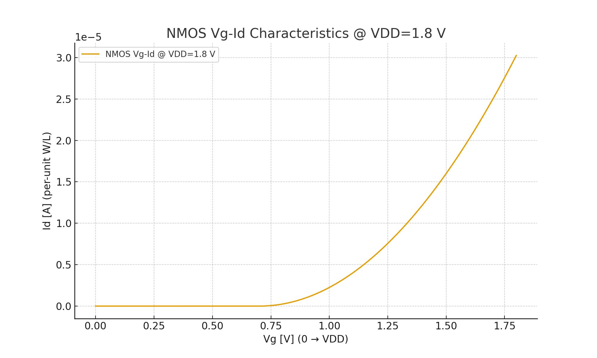
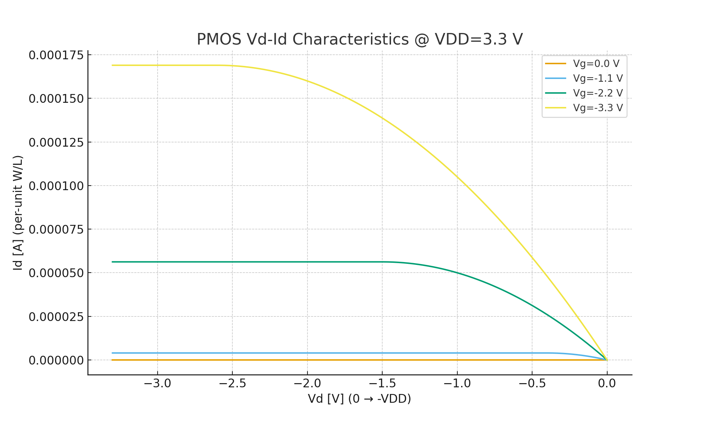

---

# 🔬 DeviceTemplates

NMOS/PMOS の基本特性を観察するための **最小 SPICE テンプレート集**  
*Minimal SPICE template collection to observe basic NMOS/PMOS characteristics.*

---

## 🎯 目的 | Purpose
- 半導体デバイスの **Vd–Id, Vg–Id** 特性を理解する  
  *Understand transistor Vd–Id and Vg–Id characteristics*  
- W/L や電源電圧の違いによるデバイス挙動を比較する  
  *Compare device behaviors under different W/L ratios and supply voltages*  
- SPICE シミュレーションから CSV 出力 → 可視化（Excel/Python）  
  *Export CSV from SPICE simulation and visualize with Excel/Python*  

---

## 📂 含まれるファイル | Contents

| ファイル名 | 説明 |
|------------|------|
| [`NMOS_VgId_1v8.sp`](./NMOS_VgId_1v8.sp) | **NMOS Vg–Id テンプレート**（W=10 µm / L=0.18 µm, VDD=1.8 V） |
| [`NMOS_VdId_1v8.sp`](./NMOS_VdId_1v8.sp) | **NMOS Vd–Id テンプレート**（W=10 µm / L=0.18 µm, VDD=1.8 V） |
| [`PMOS_VgId_1v8.sp`](./PMOS_VgId_1v8.sp) | **PMOS Vg–Id テンプレート**（W=10 µm / L=0.18 µm, VDD=1.8 V） |
| [`PMOS_VdId_1v8.sp`](./PMOS_VdId_1v8.sp) | **PMOS Vd–Id テンプレート**（W=10 µm / L=0.18 µm, VDD=1.8 V） |
| [`NMOS_VgId_3v3.sp`](./NMOS_VgId_3v3.sp) | **NMOS Vg–Id テンプレート**（W=10 µm / L=0.18 µm, VDD=3.3 V） |
| [`NMOS_VdId_3v3.sp`](./NMOS_VdId_3v3.sp) | **NMOS Vd–Id テンプレート**（W=10 µm / L=0.18 µm, VDD=3.3 V） |
| [`PMOS_VgId_3v3.sp`](./PMOS_VgId_3v3.sp) | **PMOS Vg–Id テンプレート**（W=10 µm / L=0.18 µm, VDD=3.3 V） |
| [`PMOS_VdId_3v3.sp`](./PMOS_VdId_3v3.sp) | **PMOS Vd–Id テンプレート**（W=10 µm / L=0.18 µm, VDD=3.3 V） |
| [`README.md`](./README.md) | **本ファイル**（使い方と概要） |

---

## ⚙️ 使い方 | Usage

1. `.model` を使えば PDK 不要で動作（教育用）  
   *Use `.model` for education without requiring a PDK*  

2. 実プロセス利用時は `.include` で PDK モデルを読み込み  
   *For real processes, use `.include` to load your PDK model*  

3. 実行例:  
   ```bash
   ngspice NMOS_IdVg_018um_1v8.sp
   ```

4. 出力 CSV を Excel や Python で可視化  
   *Visualize the output CSV with Excel or Python*  

---

## 📊 出力例 | Example Results

### NMOS @ 1.8 V
- **Vg–Id 特性**  
  <p align="center"></p>

- **Vd–Id 特性**  
  <p align="center"></p>

---

### NMOS @ 3.3 V
- **Vg–Id 特性**  
  <p align="center"></p>

- **Vd–Id 特性**  
  <p align="center"></p>

---

### PMOS @ 1.8 V
- **Vg–Id 特性**  
  <p align="center"></p>

- **Vd–Id 特性**  
  <p align="center"></p>

---

### PMOS @ 3.3 V
- **Vg–Id 特性**  
  <p align="center"></p>

- **Vd–Id 特性**  
  <p align="center"></p>
  
---

## 🚀 今後の拡張 | Future Extensions
- PMOS 用の追加バリエーション（高電圧対応など）  
  *Add PMOS variations (e.g., high-voltage models)*  
- 短チャネル効果を確認するための W/L バリエーション  
  *W/L variations to observe short-channel effects*  
- CSV 出力と可視化の自動化スクリプト  
  *Automation scripts for CSV export and visualization*  
