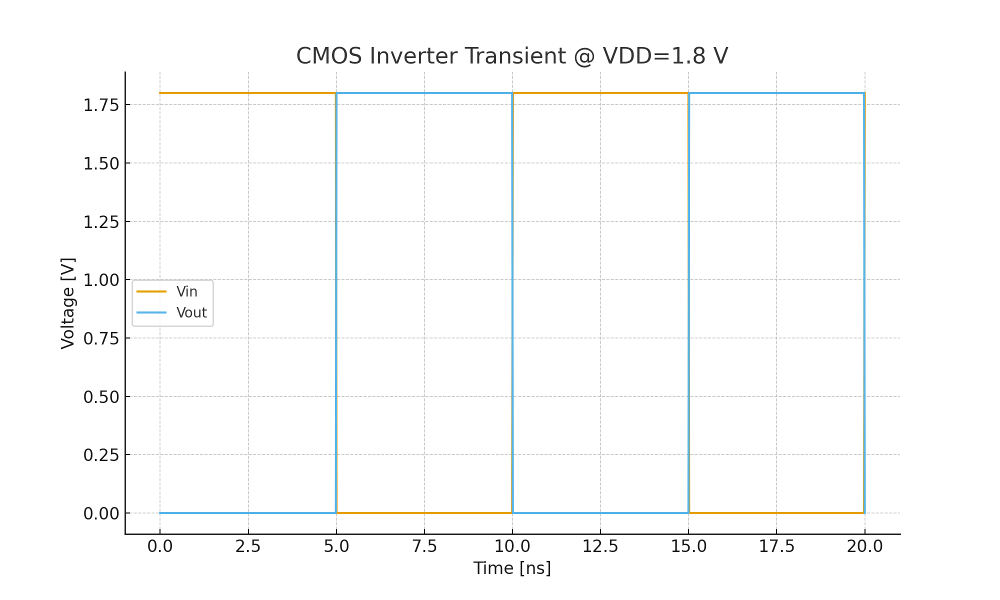
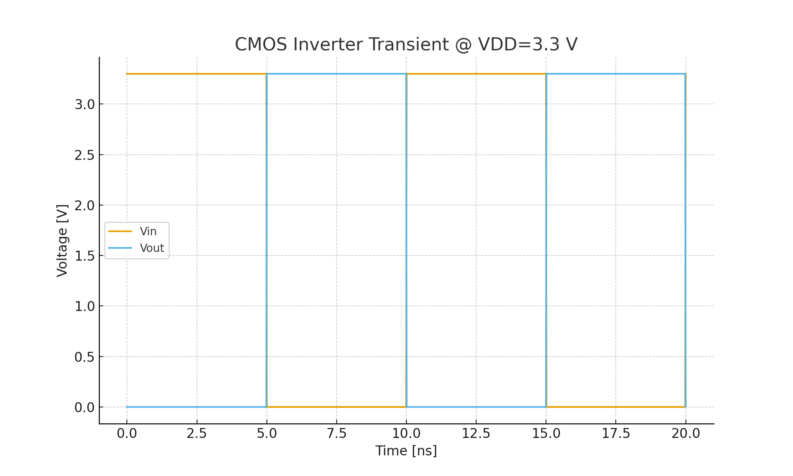
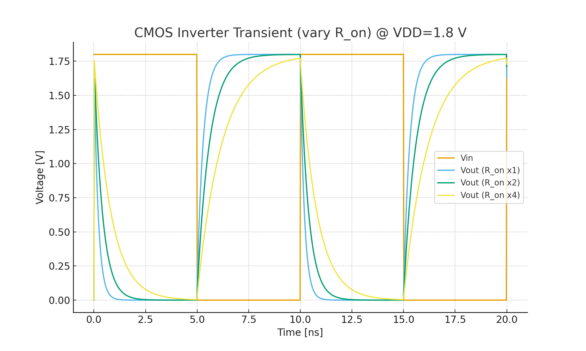
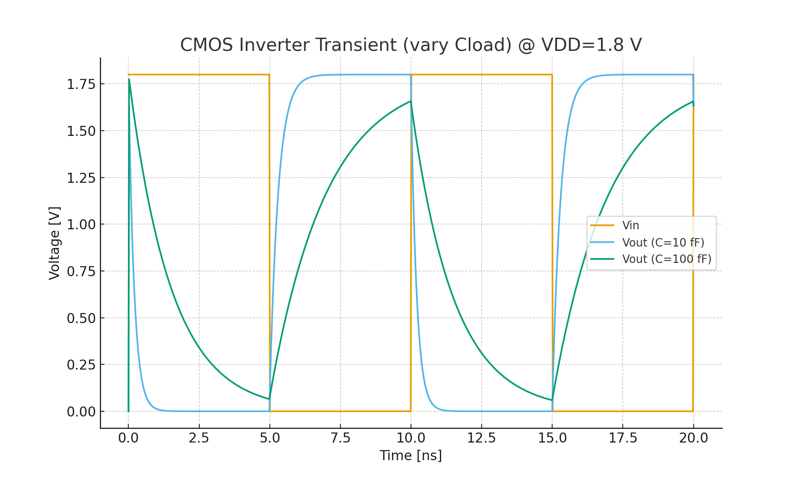

---

# 🔄 InverterTemplates

CMOS インバータの **VTC（Voltage Transfer Characteristic, 入出力特性）** と  
**トランジェント応答 (Transient Response)** を観察する最小 SPICE デッキ集  
*Minimal SPICE decks to observe CMOS inverter voltage transfer characteristics (VTC) and transient response.*

---

## 🎯 目的 | Purpose
- CMOS インバータの **入出力特性 (VTC)** を理解する  
  *Understand CMOS inverter voltage transfer characteristics (VTC)*  
- 遅延や立ち上がり/立ち下がり時間など **動的応答 (Transient)** を観察する  
  *Observe dynamic responses such as delay and rise/fall times*  
- スレッショルド電圧 (VM) やノイズマージンを評価する  
  *Evaluate threshold voltage (VM) and noise margins*  
- SPICE シミュレーションから CSV 出力 → 可視化（Excel/Python）  
  *Export CSV from SPICE simulation and visualize with Excel/Python*  

---

## 📂 含まれるファイル | Contents
| ファイル名 | 説明 |
|------------|------|
| [`Inverter_VTC_1v8.sp`](./Inverter_VTC_1v8.sp) | **CMOS インバータ VTC テンプレート**（VDD=1.8V）<br>*CMOS inverter VTC template (VDD=1.8V)* |
| [`Inverter_VTC_3v3.sp`](./Inverter_VTC_3v3.sp) | **CMOS インバータ VTC テンプレート**（VDD=3.3V）<br>*CMOS inverter VTC template (VDD=3.3V)* |
| [`Inverter_TR_1v8.sp`](./Inverter_TR_1v8.sp)   | **CMOS インバータ トランジェント テンプレート**（VDD=1.8V）<br>*CMOS inverter transient template (VDD=1.8V)* |
| [`Inverter_TR_3v3.sp`](./Inverter_TR_3v3.sp)   | **CMOS インバータ トランジェント テンプレート**（VDD=3.3V）<br>*CMOS inverter transient template (VDD=3.3V)* |
| [`README.md`](./README.md) | **本ファイル**（使い方と概要）<br>*This file (overview and usage)* |

---

## ⚙️ 使い方 | Usage
1. **教育用**: `.model` を使えば PDK 不要で動作  
   *Educational use with `.model`, no PDK required.*  

2. **実プロセス利用**: `.include` を使って PDK モデルを読み込み  
   *For real processes, use `.include` to load PDK models.*  

   ```spice
   .include sky130_fd_pr__nfet_01v8.model
   .include sky130_fd_pr__pfet_01v8.model
   ```

3. **実行例**:  
   ```bash
   ngspice Inverter_TR_1v8.sp
   ```  
   *Run the simulation with ngspice.*  

4. 出力された CSV を Excel/Python で可視化  
   *Visualize the generated CSV using Excel or Python.*

---

## 📝 補足 | Notes
- VTC (`Inverter_VTC_xx.sp`) → **静特性解析**（入力 vs 出力, ノイズマージン評価）  
  *VTC for static characteristics and noise margin evaluation.*  
- Transient (`Inverter_TR_xx.sp`) → **動的応答解析**（遅延・立ち上がり/立ち下がり時間）  
  *Transient for dynamic response (delay, rise/fall time).*

---

## 📊 出力例 | Example Results

### CMOS Inverter — Transient
- **VDD = 1.8 V**  
  <p align="center"></p>

- **VDD = 3.3 V**  
  <p align="center"></p>

---

### バリエーション | Variations
- **R_on の影響**（1×, 2×, 4×を比較）  
  <p align="center"></p>

- **C_load の影響**（10 fF, 100 fF を比較）  
  <p align="center"></p>
  
---

## 🚀 今後の拡張 | Future Extensions
- 3.3V, 5V 版インバータテンプレート  
  *Inverter templates for 3.3V and 5V supplies*  
- 過渡応答（トランジェント解析）例の追加  
  *More transient response examples*  
- ノイズマージン自動算出スクリプト  
  *Automation scripts to compute noise margins*

