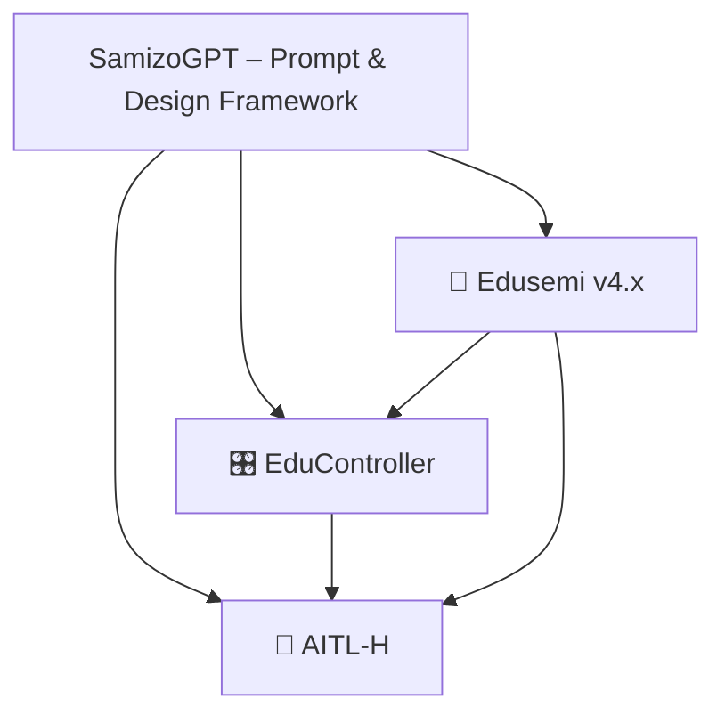

# 🔗 Project Integration Map – Edusemi × EduController × AITL-H

This document summarizes how the three major educational and technical projects by Shinichi Samizo are structurally linked.

---

## 🗺️ Overview Diagram (Mermaid)

---

## 🔄 Project Roles & Connections

| Project | Role | Links |
|---------|------|-------|
| Edusemi | Semiconductor curriculum, Sky130 design, OpenLane | → EduController (SoC control logic), → AITL-H (FSM×PID×LLM implementation) |
| EduController | Control theory + AI, Python/ROS tools | → AITL-H (LLM-integrated control logic) |
| AITL-H | Hybrid architecture for intelligent control (PoC-based) | ← Based on theories from both Edusemi and EduController |

---

## 🔁 Example Learning Pathways

### 👨‍🎓 Engineering Student
1. Start with **Edusemi基礎編** to learn device/circuit/process
2. Move to **EduController Part 1–5** to study control theory
3. Apply LLM-based reasoning via **AITL-H** using Part 9 in EduController
4. Build a PoC using FSM×PID×LLM and test on GitHub PoC

---

## 📘 Related Documents
- [Edusemi README](../Edusemi-v4x/README.md)
- [EduController README](../EduController/README.md)
- [AITL-H README](../AITL-H/README.md)
