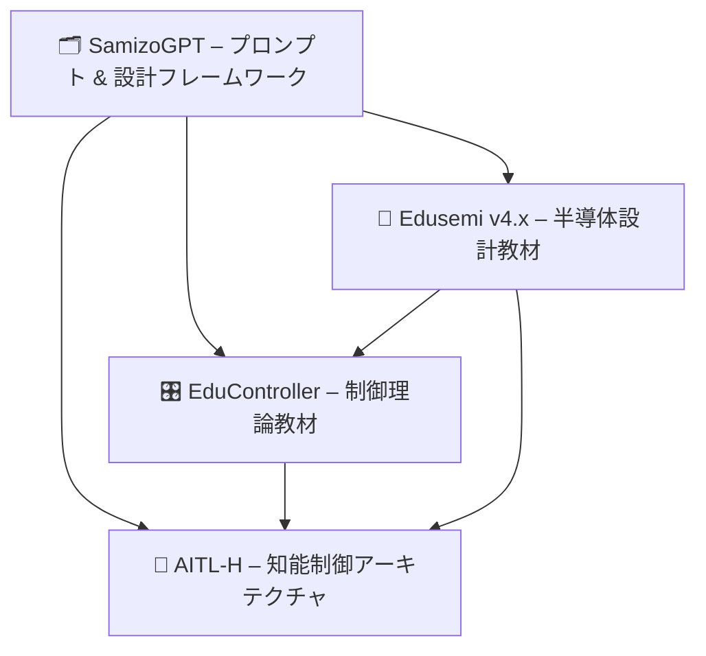

---

# 🔗 プロジェクト統合マップ | Project Integration Map – Edusemi × EduController × AITL-H

三溝真一による **3つの主要教育・技術プロジェクト**（Edusemi, EduController, AITL-H）の  
**相互連携と役割分担** をまとめたドキュメントです。  
*This document summarizes the structural links and roles of three major educational and technical projects by Shinichi Samizo.*

---

## 🗺️ 全体像（Mermaid 図）| Overview Diagram (Mermaid)

---

## 🔄 プロジェクトの役割と接続 | Project Roles & Connections

| **プロジェクト / Project** | **役割 / Role** | **接続 / Links** |
|-----------------------------|-----------------|------------------|
| 📘 **Edusemi** | 半導体カリキュラム、Sky130設計、OpenLane | → EduController (**SoC 制御ロジック**) → AITL-H (**FSM×PID×LLM 実装**) |
| 🎛️ **EduController** | 制御理論＋AI、Python/ROS ツール | → AITL-H (**LLM 統合制御ロジック**) |
| 🤖 **AITL-H** | 知能制御ハイブリッドアーキテクチャ（PoC ベース） | ← Edusemi と EduController 両方の理論に基づく |

---

## 🔁 学習パスの例 | Example Learning Pathways

### 👨‍🎓 工学系学生 | Engineering Student
1. **Edusemi 基礎編** でデバイス／回路／プロセスを学習  
   *Start with **Edusemi Basics** to learn devices, circuits, and processes.*  
2. **EduController Part 1–5** で制御理論を習得  
   *Move to **EduController Part 1–5** to study control theory.*  
3. **AITL-H** を通じて LLM を利用した推論を応用  
   *Apply LLM-based reasoning via **AITL-H**.*  
4. FSM×PID×LLM を組み合わせた PoC を構築し、GitHub PoC 上で検証  
   *Build a PoC using FSM×PID×LLM and test it on GitHub PoC.*  

---

## 📘 関連ドキュメント | Related Documents
- [📘 Edusemi README](../Edusemi-v4x/README.md)  
- [🎛️ EduController README](../EduController/README.md)  
- [🤖 AITL-H README](../AITL-H/README.md)  
